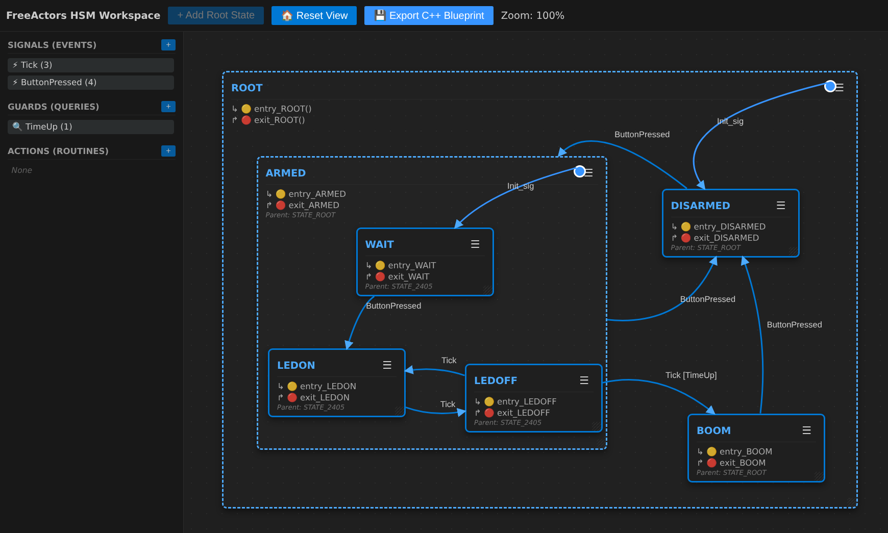

# FreeActors HSM Editor

Draw hierarchical state machines in VS Code and turn them into C++17 active objects for **FreeRTOS on Arm Cortex-M4** microcontrollers — with a desktop simulator, generated tests and a runtime trace.

> **Early preview (0.0.x).** The framework and the generated code are still evolving; expect changes before 1.0.



*The Time Bomb example from Miro Samek's [Modern Embedded Systems Programming](https://www.state-machine.com/video-course) course, drawn in the editor.*

## What you get

- **Visual editor** for `*.hsm.json` models: nested states, transitions with guards and actions, initial transitions, internal (local) events, and a registry of signals, guards and actions.
- **Export to C++17** (*💾 Export C++ Blueprint*): the state machine becomes compile-time C++ — no heap, no exceptions, no RTTI, no virtual calls — built on the **FreeActors** header-only framework, which is copied into your project.
- **UML semantics**: exit actions, then the transition action, then entry actions; hierarchical event handling; conflicting reactions are rejected at export.
- **Your code stays yours**: the generated blueprint is rewritten on every export, while your actor code, hardware requirements and tests are created once and never overwritten.
- **Hardware as a policy**: your actor declares the drivers it needs; a compile-time contract checks that the board provides them, and a generated test double (`TestBsp`) records every call in host tests.
- **Desktop simulator (REPL)**: send events, force guards, find paths to a state (`reach`) and replay them (`take`) — before any hardware exists.
- **Generated tests** (doctest): model tests of the diagram and actor tests of your real C++ code, run with CMake/CTest.
- **Runtime services**: actor-owned timers (one-shot and periodic, `schedule`/`cancel`), periodic process modules, multi-producer services; events never block, and lost events are counted.
- **Runtime trace** (`FA_TRACE`): every event (with its sender and time in the queue), guard, action and transition, streamed from the target and decoded on the PC with names from your model. Zero cost when disabled.
- **Commands from the PC** (`FA_TRACE_COMMANDS`): post events to the running target, query every actor's state, filter the trace, all from the `fa-trace` command line.
- **Health monitor** (`FA_HEALTH`): every task is checked without code in your modules; the hardware watchdog is fed only while all are healthy, and the fault that caused a reset is reported at the next start-up.

## Getting started

1. Create a file named `MyMachine.hsm.json` and open it — the editor starts with a `ROOT` state.
2. Draw the machine: *+ Add Root State*, sub-states, transitions and events; register signals, guards and actions in the side panel.
3. Click **💾 Export C++ Blueprint**. The folder of the model receives:

   | File | Owner |
   |---|---|
   | `mymachine_events.hpp`, `mymachine_hsm.hpp`, `mymachine_hw_contract.hpp`, `mymachine_test_bsp.hpp`, `mymachine_trace.json`, `freeactors_tests.cmake`, `freeactors/` | generated on every export |
   | `mymachine_actor.hpp` (guards and actions), `mymachine_bsp_policy.hpp` (hardware requirements), `tests/*.cpp`, `main.cpp`, `CMakeLists.txt` | created once, then yours |

4. Build and run on your PC (needs a C++17 compiler and CMake):

   ```bash
   cmake -B build && cmake --build build
   ./build/mymachine_sim            # REPL simulator: send <Event>, set <Guard> 1, print state, reach <State>
   ctest --test-dir build           # model and actor tests
   ```

5. On the target, the application selects the board and registers its modules:

   ```cpp
   struct Traits : Fa::DefaultAppTraits { using Platform = Board::MyBoard; };
   using Application = Fa::Application<Traits, MyMachine::Actor>;

   int main() { Application::init(); Application::start(); }
   extern "C" void vApplicationTickHook(void) { Application::on_tick_isr(); }
   ```

   FreeRTOS also needs the usual static-allocation hook (`vApplicationGetIdleTaskMemory`), with `configSUPPORT_STATIC_ALLOCATION` and `configUSE_TICK_HOOK` enabled.

   Actors use `this->post(Event{})`, `this->schedule(Tick{}, 500)` (optionally periodic) and `this->cancel(Tick{})` from their actions.

## Runtime trace

Define `FA_TRACE` — the application then creates its built-in trace service — and give the board a transport (for example a UART to the debugger's virtual COM port):

```cpp
static void trace_write(uint8_t const *data, size_t n) noexcept;   // send bytes
static uint32_t trace_timestamp() noexcept;                        // e.g. Fa::CortexM::CycleCounter::now()
static uint32_t trace_timestamp_hz() noexcept;                     // e.g. SystemCoreClock
```

Decode on the PC with the decoder copied into your project (Node.js):

```bash
node freeactors/fa-trace.js --dict . --serial /dev/ttyACM0      # or COM3, --tcp host:port, --file trace.bin
```

```
    318.940 ms  timer      [POST] Tick -> Timebomb
    318.976 ms  Timebomb   [EVENT] Tick   (from timer, 36.0 µs in queue)
    318.977 ms  Timebomb   [GUARD] TimeUp -> PASSED
    318.978 ms  Timebomb   [TRANSITION] LEDOFF ===> BOOM
```

With `FA_TRACE_COMMANDS`, type commands while the trace runs (`help` lists them, Tab completes names): `post <actor> <event>`, `states`, `health`, `filter transition`, and, with `FA_DEBUG_COMMANDS` on development builds, `pause`/`resume <task>`, `health test <task>` and `reset`.

On Windows, install the `serialport` package (`npm install serialport`) for serial input.

## Requirements

- VS Code 1.85 or later.
- Host builds: a C++17 compiler (GCC or Clang) and CMake 3.14+.
- Firmware: `arm-none-eabi-gcc`, a FreeRTOS kernel (static allocation, tick hook enabled) and your MCU's device support; the framework itself is vendor-neutral.
- Trace decoder: Node.js.

## Known limitations

- Tested on Linux; Windows and macOS are not yet verified.
- One instance per state machine, and each event type has exactly one receiving actor.
- Verified on one board so far (STM32F446, Nucleo-F446ZE); the board contracts are written for any Cortex-M4.

## License

MIT — the full text is in the LICENSE file included with the extension. Includes [doctest](https://github.com/doctest/doctest) (MIT).
