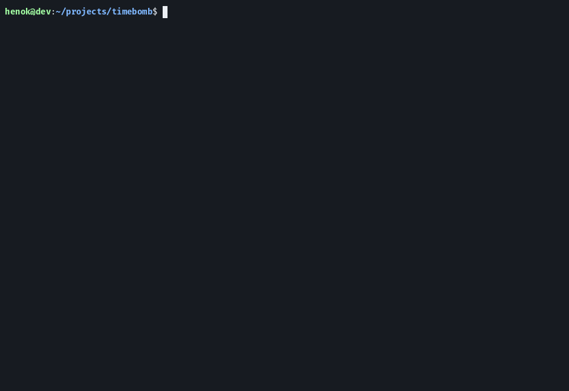
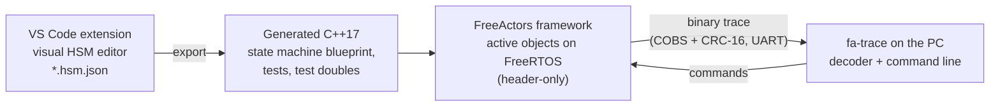

# FreeActors

**Hierarchical state machines for FreeRTOS on Arm Cortex-M4: drawn in VS Code, generated as C++17, and observable while they run on the hardware.**



*Above: `fa-trace` connected to a Nucleo-F446ZE over its USB serial port. The PC posts two events, the board's own timer drives the blink, `filter transition` narrows the trace, and the bomb ends in `BOOM`. Every line comes from the running firmware, decoded with names from the model.*

## What it is

Three parts that work together:



1. **A VS Code extension** for drawing hierarchical state machines and exporting them as C++.
2. **The FreeActors framework**: each state machine becomes an *active object* with its own FreeRTOS task and event queue. Events are routed to their receiver at compile time; there is no heap, no exceptions, no RTTI and no virtual dispatch.
3. **`fa-trace`**, a PC tool that decodes the target's trace and sends it commands: post an event, query every actor's state, check the health of every task, pause one.

## Highlights

| | |
|---|---|
| **Compile-time design** | Event routing, state tables and the hardware contract are resolved by the compiler. A missing receiver, an ambiguous one, or a board that lacks a driver function the model needs is a compile error. |
| **UML semantics** | Exit actions, then the transition action, then entry actions; events bubble up the state hierarchy; conflicting reactions are rejected at export. |
| **Static memory only** | Tasks, queues, timers and buffers are statically allocated. Events never block: a full queue drops the event and counts it (and asserts in debug builds). |
| **Runtime trace** | Every event (with its sender and time spent in the queue), guard, action and transition, as 8-byte records timestamped by the Cortex-M cycle counter. Zero cost when disabled. |
| **Commands from the PC** | Post events, query states, filter the trace, ask for a health report. Replies travel on the trace stream, so the order on screen is the order on the target. |
| **Health monitor** | Every task the framework runs is checked without code in the modules: stuck in a step, work waiting without progress, or input that stopped arriving. The hardware watchdog is fed only while all are healthy, and the fault that caused a reset is reported after the restart. |
| **Continuous DMA reception** | A lock-free ring for circular DMA (UART with idle-line detection, ADC blocks), with overrun detection that also covers data overwritten while it was being read. |
| **Vendor-neutral** | Board contracts (DMA, watchdog, trace transport, reset cause) are stated as requirements and checked against STM32, NXP Kinetis/LPC, TI TM4C, Microchip SAM4, Nordic nRF52, Renesas RA and Infineon XMC. |

### Measured on the reference board

Nucleo-F446ZE (STM32F446, Cortex-M4F), core clock 16 MHz (internal oscillator, no PLL), the Timebomb example application:

| | |
|---|---|
| Complete firmware (FreeRTOS kernel, STM32 HAL, trace, commands, health monitor, debug commands) | 17.2 KB flash, 10.5 KB RAM |
| Post to handled, measured by the trace | about 60 µs |
| Largest stack frame in any framework function | 56 bytes (the build fails above 256) |

## From model to trace

The model is drawn in the editor and stored as `Timebomb.hsm.json`:


Export generates the blueprint and leaves a class for your code:

```cpp
template <typename HwPolicy, typename Ctx>
class Actor : public Fa::Hsm<Actor<HwPolicy, Ctx>, Event> {
public:
    static constexpr uint16_t BlinkMs = 500;

    bool TimeUp() const { return ticks == 0; }                        // guard

    void entry_LEDON() {                                              // entry actions
        HwPolicy::set_blue_led(true);
        --ticks;
        this->schedule(Tick{}, BlinkMs);                              // one-shot timer, owned by this actor
    }
    void entry_LEDOFF() {
        HwPolicy::set_blue_led(false);
        this->schedule(Tick{}, BlinkMs);
    }
    void entry_BOOM() { HwPolicy::set_red_led(true); }
    // ...
private:
    uint8_t ticks{CountdownTicks};                                    // blinks left before BOOM
};
```

The application picks the board once and lists its modules:

```cpp
struct Traits : Fa::DefaultAppTraits { using Platform = Board::NucleoF446ZE; };
using Application = Fa::Application<Traits, Timebomb::Actor, ButtonPoller>;

int main() { HAL_Init(); Application::init(); Application::start(); }
```

Before any hardware exists, the same model runs in the generated desktop simulator:


## How it is tested

One command, `npm test`, runs every layer (76 checks):

| Layer | What it proves |
|---|---|
| Model tests | the generated state machine follows the diagram (UML entry/exit/action order, guards, hierarchy) |
| Actor tests | the real actor code on the host, with a generated test double that records every hardware call |
| Generator | each example model exported as a complete new project, built with CMake, its generated tests run |
| Lock-free queues | multi-threaded stress tests (hundreds of thousands of items) under ThreadSanitizer |
| FreeRTOS runtime | a real application on the FreeRTOS POSIX port: timers with real-time tolerances, full queues, commands sent through a simulated UART DMA, the health monitor silent through the whole run and then detecting injected faults; the decoded trace checked line by line |
| Target build | Cortex-M4 cross-compiles with and without FPU and with every feature, with a size report and a 256-byte stack-frame limit |
| Mutation checks | the critical properties were deliberately broken to confirm the tests catch it |
| Hardware | the reference board: trace, commands, DMA reception, watchdog resets and the fault report after them |

## Design documents

- [Trace and remote control](docs/design/trace.md): records, wire format, commands, the decoder.
- [Single-producer services and continuous DMA](docs/design/dma.md): the lock-free core, overrun detection, how different DMA controllers meet the contract.
- [Health monitoring and watchdog management](docs/design/health.md): what is measured, the faults, the watchdog contract on different vendors, pausing tasks for debugging.

## Repository layout

| Path | Contents |
|---|---|
| [`freeactors_lib/`](freeactors_lib/) | the framework (header-only C++17) |
| [`src/extension.ts`](src/extension.ts) | the VS Code extension: editor host and code generators |
| [`media/`](media/) | the editor's web view |
| [`tools/fa-trace.js`](tools/fa-trace.js) | trace decoder and command line (Node.js) |
| [`tests/`](tests/) | everything `npm test` runs |
| [`docs/design/`](docs/design/) | design documents |

## Build and test

```bash
npm install
FREERTOS_KERNEL_PATH=~/FreeRTOS/FreeRTOS/Source npm test   # a FreeRTOS kernel 'Source' folder
```

Needs g++, CMake and Node.js; the FreeRTOS and Cortex-M4 layers also need a FreeRTOS kernel checkout and `arm-none-eabi-gcc` (skipped without them). In VS Code, F5 opens a development host with the extension.

The extension is packaged with `npm run package`; its user guide (the Marketplace page) is [MARKETPLACE.md](MARKETPLACE.md).

## Status

Early preview (0.0.x), heading for 1.0. Working and verified on one board; the main open points are:

- a second board from another vendor, to prove the contracts in practice;
- one instance per state machine and one receiver per event type (deliberate in v1; multiple instances are planned for v2);
- tested on Linux; Windows and macOS not yet verified.

[BACKLOG.md](BACKLOG.md) has the full list.

## How it was built

The state machine engine (`fa_core.hpp`, the type-list metaprogramming in `fa_util.hpp`, the compile-time reflection), the code generator and the desktop simulator were written by hand, using common C++ metaprogramming techniques (type lists, detection idioms).

The visual editor and the runtime platform (FreeRTOS services, trace transport and commands, DMA reception, the health monitor, `fa-trace`, the test harness and the design documents) were developed with an AI coding assistant (Claude, by Anthropic); those commits are marked `Co-Authored-By`. Design decisions and testing on the hardware were done by me.

## License

MIT. Includes [doctest](https://github.com/doctest/doctest) (MIT).
